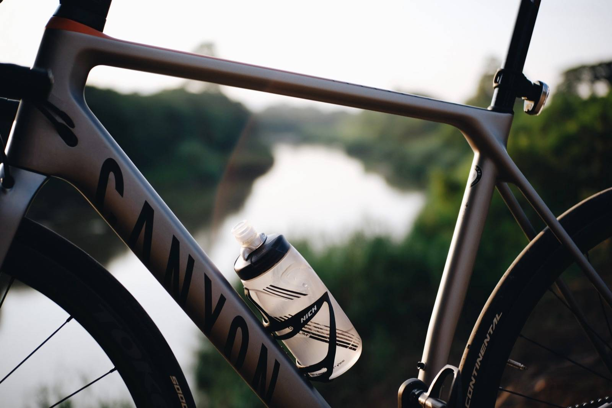
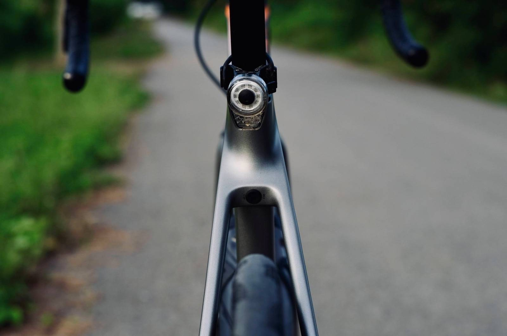
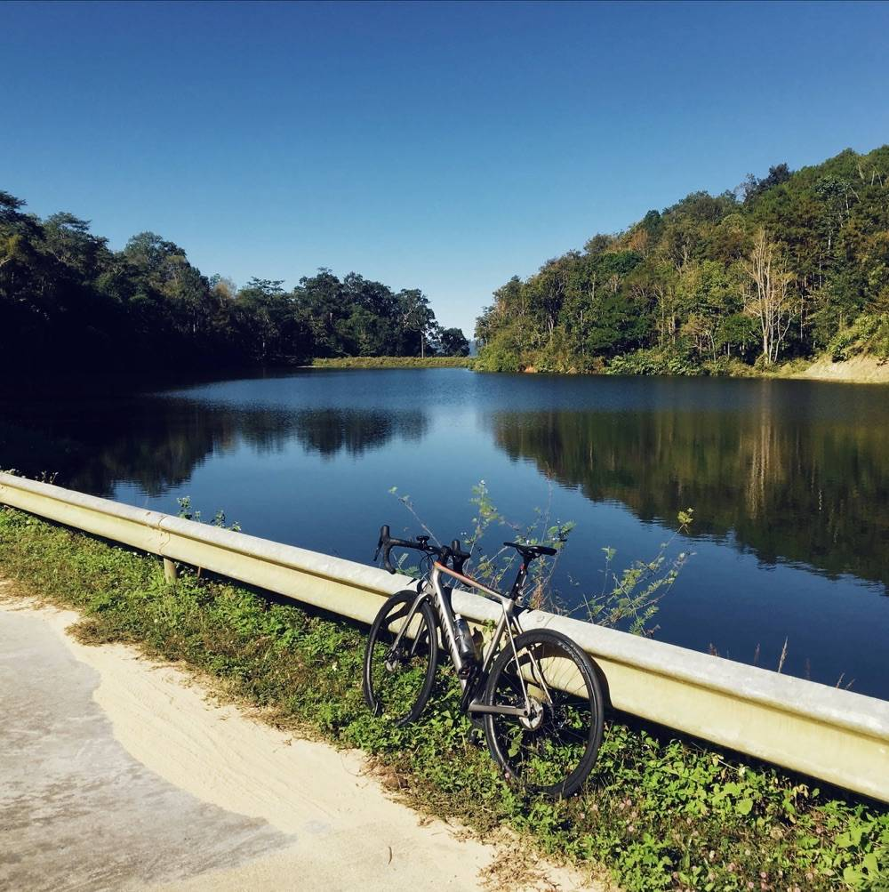
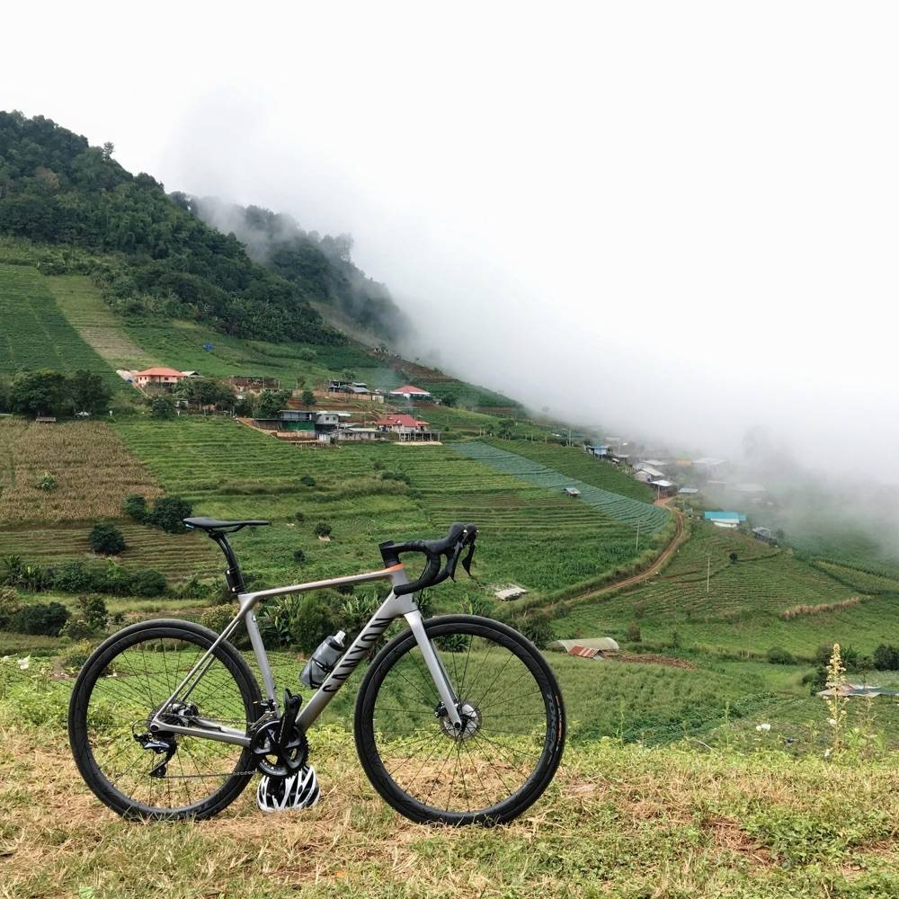
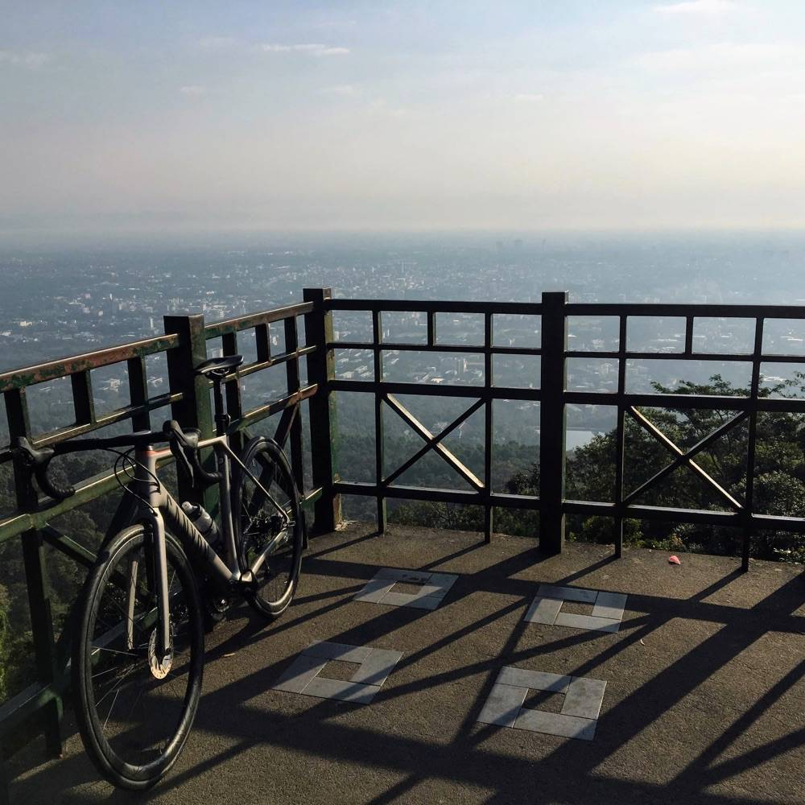
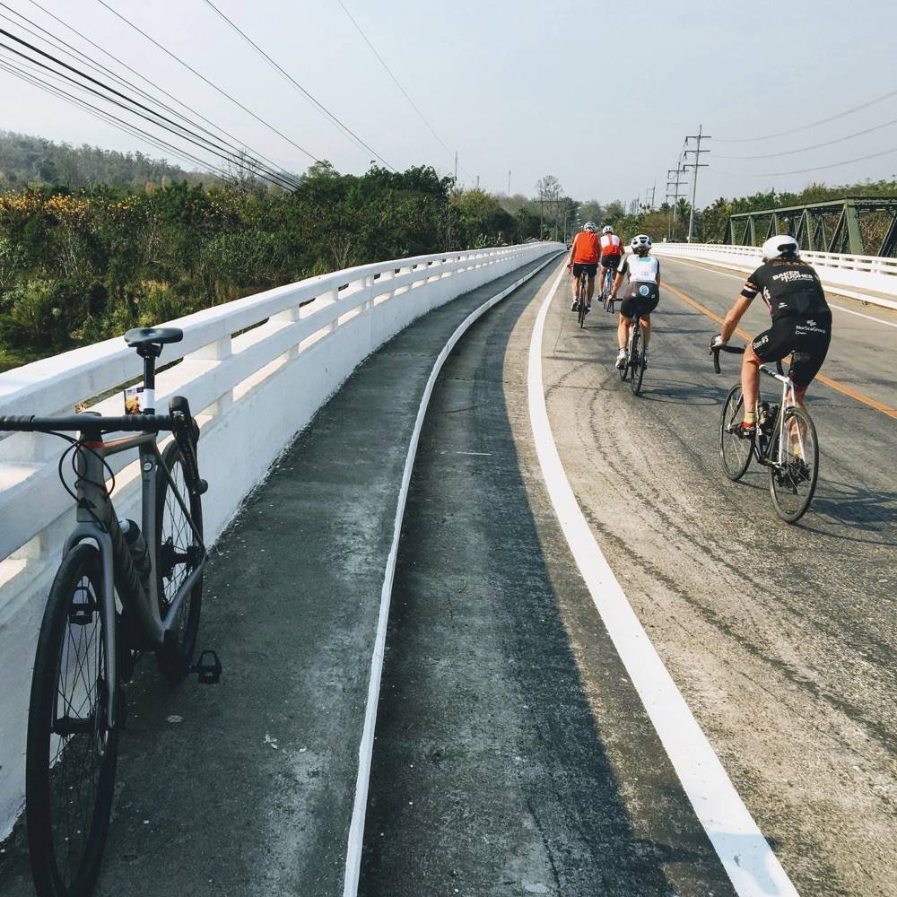
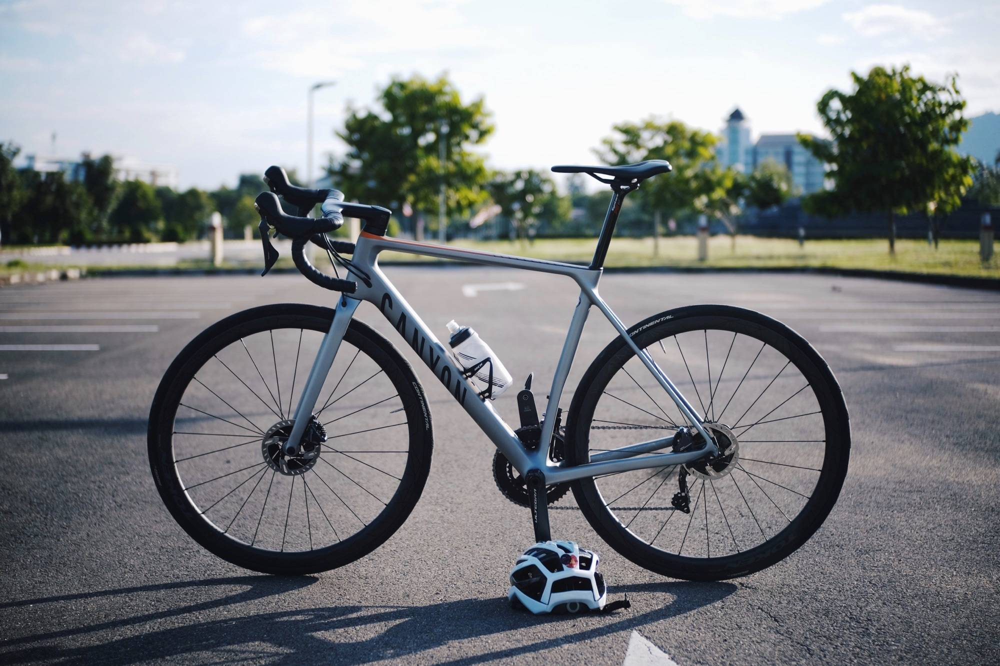
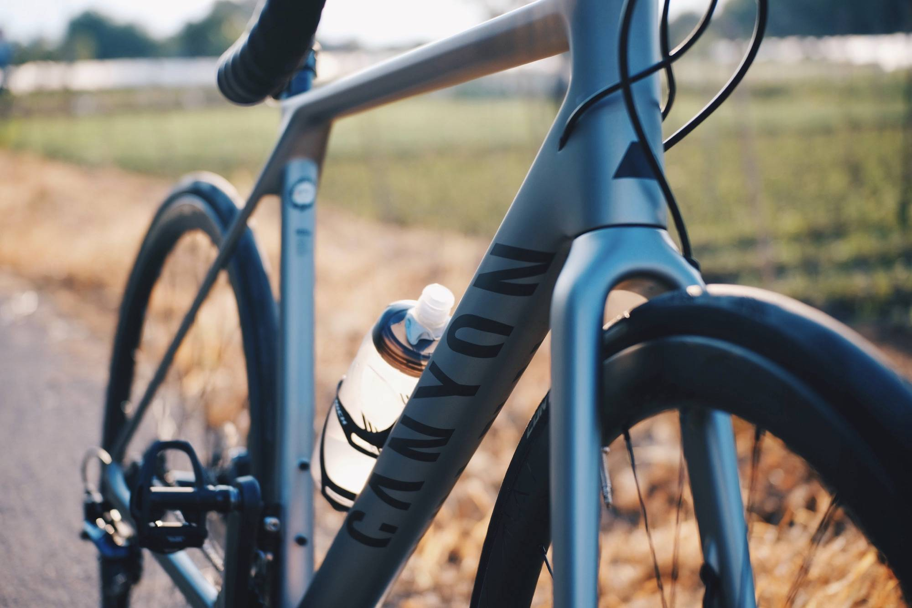

โพสต์นี้เป็นภาคจบของบทความชุดเกี่ยวกับจักรยาน Canyon Endurace CF SL รุ่นปี 2018 ที่ผมใช้อยู่ครับ
ซึ่งทั้ง 3 บทความก็คือ

1. [รีวิว: สั่งซื้อจักรยานจาก Canyon](https://armno.in.th/2019/01/28/ordering-a-canyon-bike-review/)
2. [แกะกล่อง Canyon Endurace CF SL](https://armno.in.th/2019/09/11/unboxing-canyon-endurace-cf-sl/)
3. **รีวิว Canyon Endurace CF SL (2018)** (โพสต์นี้)

## ทำไมต้องเป็น Canyon Endurace

จักรยานคันก่อนหน้านี้ของผมคือ [Storck Visioner Comp G1](https://armno.in.th/2018/03/17/review-storck-visioner-comp-g1/)
ที่เคยเขียนรีวิวไปแล้วเมื่อก่อนโน้น เป็นจักรยานที่ขี่สนุกดีครับ ขึ้นเขาดี ลงเขาดีมากกก (ชอบมาก)
แต่ยังมีสิ่งที่คอยรบกวนใจอยู่บ่อยๆ คือองศาเฟรมที่ค่อนข้างซิ่ง ต้องก้มและเหยียดเยอะ ปั่นนานๆ จะไม่ค่อยสบายตัวเท่าไหร่

<!--  -->

ผมเลยอยากหาจักรยานคันใหม่ที่ปั่นสบายกว่า ความคิดเลยย้อนไปหาจักรยานในฝันอีกครั้ง
นั่นก็คือ Canyon

มีจักรยาน road bike ให้เลือก 3 แนวทางคือ

- Aeroad - จักรยานแอโร่ เน้นทำความเร็ว
- Ultimate - จักรยาน all round เน้นน้ำหนักเบา และการปั่นขึ้นเขา
- Endurace - จักรยานแนว endurance เน้นความสบายและการปั่นทางไกล

Ultimate กับ Endurace ดูลักษณะเฟรมแล้วคล้ายกัน รูปทรงหลายส่วนก็คล้ายกัน
สุดท้ายตัดสินใจเลือก Endurace เพราะองศาเฟรมน่าจะปั่นสบายกว่า Ultimate
โดยที่ฟีเจอร์อื่นๆ น่าจะไม่หนีจาก Ultimate มากนัก (เดาล้วนๆ)

<!--  -->

## สเป็ค

- เฟรม Canyon Endurace CF SL (M)
- ชุดเกียร์ Shimano Ultegra Disc R8020
  - จานหน้า 50/34T / 172.5mm
  - เฟือง Ultegra 11-32T / Dura-Ace 11-28T
  - ใบดิสก์ Dura-Ace SM-RT900 140mm
- ล้อ Token Ventous Disc
- ยาง Continental GP5000, 28mm
- บันได Shimano Dura-Ace PD-R9100
- หลักอาน Syntace P6 Carbon
- เบาะ SQLab 612 / Bontrager Aeolus Elite

น้ำหนักชั่งจริงประมาณ 7.4-7.5kg (แล้วแต่เฟืองที่ใช้)
แต่ตอนปั่นจริงติดทั้งไฟหน้า ไฟท้าย ถุงเก็บอุปกรณ์ใต้เบาะ รวมกระติกน้ำแล้วด้วยก็ประมาณ **8.0kg** ครับ

### เฟรมเซ็ต Canyon Endurace CF SL

Endurace เป็นจักรยานเสือหมอบแนว endurance ของ Canyon
เน้นความสบายและการปั่นเส้นทางระยะไกล ยังมีฟีเจอร์สำหรับจักรยานแข่งขันอยู่บ้าง
แต่ไม่สุดเท่า Ultimate ที่เป็นจักรยานเสือหมอบแข่งขันแบบเต็มตัว

<!--  -->

เฟรมเซ็ต Endurace CF SL Disc ใช้คาร์บอนเกรดรองท็อปของซีรี่ส์ Endurace
(ตัวท็อป SLX, รองท็อป SL)
ใช้ดิสก์เบรคแบบ flat mount แกนหน้า 12x100mm หลัง 12x142mm
น้ำหนักตามสเป็คอยู่ที่ประมาณ 960 กรัม ตะเกียบอีกประมาณ 390 กรัม
ตัวเฟรมเป็นสีเงิน เคลือบด้าน ไม่ค่อยมีลวดลายอะไร ดู minimal ดี

ในชุดมีตัวเฟรม ตะเกียบ ชุดแฮนด์อินทิเกรต Canyon H31 กับหลักอานเยื้องหลัง Canyon S15 VCLS 2.0
ของผมเป็นรุ่นที่ใช้ได้เฉพาะกับเกียร์แบบ mechanical

<!--  -->

สิ่งที่มีเหมือนกับระหว่าง Canyon Endurace กับ Ultimate คือ
ทรงท่อล่าง, ท่อตั้ง, กับ seatstay เป็นแบบ D-Shape ช่วยเรื่องแอโร่นิดหน่อย
ส่วนทรงท่อนอนเป็นทรงคล้ายรูป 5 เหลี่ยมแบนๆ

อีกอย่างที่เหมือนกันคือ ฟีเจอร์ที่เน้นช่วยเพิ่มความสบายและซับแรงสะเทือนคือ จุดเชื่อม seatstay เหลื่อมไปเชื่อมกับท่อนอนเล็กน้อย ไม่ได้เชื่อมกับท่อนั่งตรงๆ
จุดยึดหลักอานอยู่ต่ำลง ช่วยเพิ่มระยะให้ตัวของหลักอาน เป็นฟีเจอร์ที่ Canyon ใช้กับรถหลายๆ รุ่นเหมือนกันครับ

  

    
    
  

ที่ต่างจาก Ultimate คือองศาเฟรมของ Ultimate จะซิ่งกว่า reach ยาวและ stack สั้นกว่าเล็กน้อย
ส่วน Endurace เป็นเฟรมแนว endurance องศาจึงค่อนข้าง relax คือไม่ก้มเหยืยดจนเกินไป
ไซส์ M มีระยะ reach ที่ 382mm ระยะ stack ที่ 578mm บวกกับชุด cockpit ที่มีระยะไม่ยาวมาก
พอประกอบออกมาเป็นคันแล้ว ถึงไม่ต้องรองแหวนล่างสเต็ม ก็ยังได้ท่าปั่นที่สบายอยู่

**ชุด cockpit: Canyon H31 Ergocockpit** เป็นชุดแฮนด์กับสเต็มในชิ้นเดียว สเต็มยาว 100mm แฮนด์กว้าง 420mm
ระยะ reach 70mm, drop 128mm น้ำหนักตามสเป็ค 285 กรัม

<!--  -->

ผมชอบตรงที่มี backsweep ที่ 6 องศา (เท่ากับแฮนด์ Syntace Racelite) ทำให้แฮนด์ด้านบนโค้งเข้ามาหาตัวนิดหน่อย
จับด้านบนแล้วเข้ามือดีมาก ระยะ reach น้อยก็ช่วยให้ไม่ต้องเอื้อมเยอะ

<!--  -->

ข้อตินิดเดียวคือ รู้สึกว่ามันกว้างไปหน่อย เมื่อเทียบกับแฮนด์ Syntace ขนาด 420mm เท่ากันแล้ว
ผมรู้สึกว่าชอบความกว้างแฮนด์ของ Syntace มากกว่า

**หลักอาน Canyon S15** ที่ดูเทคโนโลยีล้ำดี
เป็นแท่งหลักอานคาร์บอน 2 ชิ้นประกบกัน (leaf spring) ช่วยเรื่องความนุ่มสบายและซับแรงสะเทือน
ตัวจับสามารถปรับระยะเยื้องหลัง (setback) ได้สองแบบคือ 13mm กับ 25mm

แต่ใช้งานจริงยุ่งยากนิดหน่อยครับ เวลาจะปรับเบาะให้ก้ม-เงย
ต้องถอดหลักอานออกมาจากเฟรมก่อน แล้วปรับเลื่อน แล้วค่อยใส่กลับเข้าไปในเฟรม

<!--  -->

สิ่งที่สำคัญกว่านั้นคือ มันเป็นหลักอานเยื้องหลัง สำหรับผมที่ช่วงขาสั้น ถ้าใช้หลักอานเยื้องหลังกับคันนี้ มันต้องเลื่อนเบาะมาหน้าสุด เซ็ตรถออกมาแล้วดูแปลกๆ
สุดท้ายเลยเปลี่ยนไปใช้หลักอานตรงของ Syntace แทน ชีวิตง่ายขึ้นเยอะ
แต่เสียดายเหมือนกันที่ไม่ได้ใช้หลักอาน S15 ที่มากับเฟรม

### ชุดเกียร์ Shimano Ultegra Disc R8020

<!--  -->

ชุดเกียร์ hydraulic disc brake รุ่นรองท็อปจากค่าย Shimano
ชุดจานหน้าขนาด 50/34T ขายาว 172.5mm
ตีนผีขายาว (รหัส GS) ใช้เฟืองหลัง 11-32T เป็นสูตรสำเร็จที่ผมลอกมาจากคันเดิม
ซึ่งคิดว่าเพียงพอสำหรับการปั่นทัวไป หรือไต่ดอยที่ได้ไปบ่อยๆ

<!--  -->

ใบดิสก์น่าจะเป็นส่วนเดียวที่ไม่เข้ากับ group set
ที่เลือกใช้ใบดิสก์ Dura-Ace เพราะรู้สึกว่าทำให้รถดูสวยกว่าใบดิสก์ Ultegra
ส่วนการใช้งานนั้นไม่ต่างกันเลย เบรคได้ดีเหมือนกัน

<!--  -->

ในการใช้งานจริง ชุดเกียร์ Ultegra นั้นไม่มีอะไรให้ติ
ผมใช้งานมา 3 ปี ยังไม่เคยมีปัญหาเลยทั้งระบบเกียร์และระบบเบรค
เปลี่ยนเกียร์ได้แม่นยำและฉับไว เบรคสบายหายห่วง

แต่ถ้าเทียบกับ rim brake แล้วชุดเกียร์ disc brake มีเรื่องจุกจิกมากกว่า rim brake อยู่ดี
ที่ผมเจอก็มี: ใบดิสก์ชอบไปสีกับผ้าเบรค, เบรคหอนเวลาลงเขายาวๆ ตอนฝนตก, ใบดิสก์เบี้ยว,
,การทำความสะอาดผ้าเบรค + ลูกสูบ
หรือการตั้งระยะเบรคที่มีรายละเอียดเยอะกว่า rim brake
ซึ่งก็คงเป็นเรื่องที่ต้องอยู่กับมันแหละครับ

### ล้อ Token Ventous Disc + ยาง Continental GP5000 (ยางงัด)

ล้อ Token อาจจะไม่ได้เป็นล้อที่อยู่ในกระแสหลักเท่าไหร่ แต่ในบ้านเราก็ได้รับความนิยมพอสมควร
เป็นล้อที่มีหลายคนใช้สำหรับแข่งขันเหมือนกัน จุดเด่นที่ขายกันคือ ความคุ้มค่าและความทนทาน

<!--  -->

 Token Ventous Disc เป็นล้อคาร์บอนที่อยู่ในช่วงราคากลางๆ ขอบสูง 36mm
 ขอบนอกกว้าง 27.4mm ขอบในกว้าง 20mm เหมาะกับยาง 25c ขึ้นไป
 รุ่นอื่นที่ใกล้เคียงกันของ Token คือ Konax Pro กับ Konax Tri ที่ทุกอย่างแทบจะเหมือนกันหมด
 ต่างกันแค่ความสูงขอบล้อ

จุดเด่นน่าจะอยู่ที่น้ำหนักเบา ประมาณ 1,455g
เป็นล้อ tubeless-ready คือใช้งานกับยาง tubeless ได้ แต่ในชุดไม่ได้แถมจุก tubeless มาให้ด้วยครับ

ยางที่ใช้ตอนนี้เป็น Continental GP5000 ขนาด 28c รวมกับขอบอ้วนๆ ของล้อแล้ว
ก็ยังเหลือระยะ clearance ของตัวเฟรม ที่ทำให้ใส่ยางกว้างกว่านี้ได้อยู่ (ตามสเป็คบอกว่าใส่ได้ถึง 30mm)

<!--  -->

พอรวมการใช้งานจริงของล้อกับยางคู่นี้แล้ว ผมก็รู้สึกว่ามันเบาขาดี เป็นล้อที่ปั่นได้เรื่อยๆ ทั้งทางเขาและทางราบ
แต่ไม่ก็ไม่ถึงกับว่า ล้อมันแข็งและพุ่งแบบเปิดวาร์ปอะไรแบบนั้น

### เบาะ SQLab 612 / Bontrager Aeolus Elite + หลักอาน Syntace P6 Carbon

เบาะที่ติดรถตอนนี้เป็น SQLab 612 ราง S-tube รุ่นธรรมดา (ไม่ active) เบอร์ 14

<!--  -->

ก่อนหน้านี้เคยใช้เบาะ Specialized Romin Evo ซึ่งก็ได้ใช้งานได้ดี ไม่ได้มีปัญหาอะไรกับก้นผม แต่ก็ยังมีความรู้สึกอยากลองเบาะทรงอื่น เผื่อจะเข้ากับก้นได้ดีกว่า

เลยซื้อเบาะ Bontrager Aeolus Elite มาลอง ส่วนหนึ่งก็เป็นเพราะกระแสแรง
อีกส่วนคือได้น้ำหนักเบากว่า (ราง Austenite) ในราคาที่ถูกกว่าเมื่อเทียบกับหลายๆ ยี่ห้อในระดับเดียวกัน ผมได้ลองใช้เป็นขนาด 145mm

<!--  -->

ใช้จริงเมื่อเทียบกับ SQLab 612 คือ  นั่งครั้งแรกจะรู้สึกว่ามันเต็มก้นดี ปีกเบาะกว้างและแข็งกว่า
แต่ตอนปั่นกลับรู้สึกว่าปีกเบาะมันให้ตัวได้มากกว่า SQLab อยู่นิดหน่อย (อาจเป็นเพราะปีกกว้างกว่าหรือเพราะนั่งได้เต็มก้นกว่า)
คือไม่ใช่ความรู้สึกย้วยนะครับ ตรงข้ามเลยคือแข็งและส่งกำลังได้ดี
ที่ชอบมากกว่า SQLab คือตอนปั่นแบบจับ drop เพราะสบายไข่พอๆ กับตอนจับ hood เลย
และตัวเบาะเป็นแบบจมูกสั้น เวลาก้มเยอะๆ เลยไม่รู้สึกเกะกะเท่าไหร่ เหมาะกับสายซิ่ง
ทางผู้ผลิตก็บอกชัดแล้วว่าเป็นเบาะแนว aero สำหรับแข่งขัน

แต่ปัญหาที่ผมเจอ ก็คือความแข็งนี่แหละครับ
สำหรับผม ถ้าจะใช้เบาะ Aeolus ต้องเลือกกางเกงดีๆ หน่อย ไม่งั้นปั่นนานแล้วจะเจ็บก้น
เวลาผมใช้จักรยานสำหรับเดินทางไปไหนมาไหน ก็ไม่ได้ใส่กางเกงปั่นทุกครั้ง ก็มีปวดก้นบ้าง
ซึ่งไม่เจอกับ SQLab เลยกลับไปใช้เบาะ SQLab เหมือนเดิมครับ เป็นมิตรกับชีวิตประจำวันมากกว่า

หลักอาน Syntace P6 Carbon ขนาด 27.2mm ที่ซื้อมาเพื่อใช้แทนหลักอาน S15 ตามที่กล่าวมาก่อนหน้านี้
ใช้งานได้ดีไม่มีปัญหาอะไรครับ

## ฟีลลิ่งการปั่นโดยรวม

จักรยาน Canyon Endurace คันนี้ใช้มาตั้งแต่ปี 2018 ถึงตอนนี้ (กันยายน 2021) ก็ประมาณ 3 ปีพอดี
เป็นช่วงชีวิตที่มีการเปลี่ยนแปลงหลายอย่าง ทำให้ไม่ได้ปั่นเยอะเหมือนเมื่อก่อน
ผมใช้จักรยานเพื่อการเดินทางท่องเที่ยวและออกกำลังกาย ไม่ได้ใช้เพื่อแข่งขันหรือตั้งโปรแกรมซ้อมครับ

<!--  -->

ได้ใช้คันนี้ปั่นไปหลายๆ เส้นทางที่เคยได้ปั่นอยู่บ่อยๆ เช่น ดอยสุเทพ, บ้านแม่ขิ-สะเมิง, สะเมิงลูป
รวมไปถึงการร่วม event ปั่นไปปายกับ HIP Magazine ในงาน [HIP ปั่นปาย ครั้งที่ 4](https://armno.wordpress.com/2019/02/19/845-hip-pan-pai-4/)

  

    
    
    
    
  

Canyon Endurace เป็นจักรยานแนว endurance ท่านั่งจะก้มไม่เยอะ
การปั่นไกลๆ หรือนานๆ จะสบายตัวกว่ารถแข่งซิ่งๆ
ตัวเฟรมที่เป็น disc brake มันซับแรงสะเทือนได้ค่อนข้างดีกว่า rim brake อยู่แล้ว
พอบวกกับยางขนาด 28c ที่ผมเติมลมยางที่ 70/75 psi เลยทำให้เป็นรถที่ซับแรงสะเทือนได้ดีมากๆ โดยเฉพาะในช่วงหลัง
ซึ่งผมว่าเป็นจุดเด่นที่สุดของรถคันนี้ครับ ช่วงหลังแน่นและมั่นคง เป็นรถที่พาลุยได้ทุกที่ หลากหลายเส้นทาง

<!--  -->

แต่ถ้าใครที่ปั่นรถแนวแข่งขันมาบ่อยๆ อาจจะรู้สึกว่ามันนุ่มจนน่าเบื่อได้ครับ
พอมันซับแรงสะเทือนได้เยอะ มันเลยรู้สึกเหมือนไม่ค่อยเร็ว (แต่ความจริงก็เร็วนั่นแหละ)

ในทางกลับกัน ผมกลับรู้สึกว่า ช่วงหน้ารถมันสะเทือนมากกว่าช่วงหลัง
อาจเป็นเพราะชุดแฮนด์อินทิเกรตแบบชิ้นเดียว หรือเป็นเพราะตะเกียบหน้าก็ไม่อาจทราบได้
แต่รวมๆ แล้วช่วงหน้าแข็งกว่า Visioner จะไปรู้สึกชัดๆ ตอนความเร็วสูงหรือถนนขรุขระมากๆ ครับ

<!--  -->

ความสติฟและการส่งแรง สำหรับผมก็เหลือใช้ทั้งทางราบและขึ้นเขา ทั้งนั่งปั่นและยืนปั่น
ในทางราบไม่ได้รู้สึกว่าออกตัวไว หรือพุ่งติดเท้ามากนัก แต่ทำความเร็วขึ้นไปได้ถึงระดับกลางๆ ไม่ยากเลย

ที่สังเกตได้อย่างหนึ่งคือ ตอนขึ้นเขามันไม่รู้สึก "หนัก" เท่ากับ Strock Visioner ทั้งๆ ที่คันนี้น้ำหนักเยอะกว่า
เป็นเฟรมที่ปั่นแล้วทำให้รู้สึกว่าไม่ได้ "ปรู๊ดปร๊าด" แต่ก็ไปได้ "เรื่อยๆ" ดีเหมือนกัน

การลงเขานั้นก็ทำได้ดี รถค่อนข้างนิ่งและคุมง่าย เข้าและออกโค้งได้ดี
แต่ในช่วงความเร็วสูงเกิน 60 kph ขึ้นไป จะมีความรู้สึกว่าช่วงหน้าเริ่มไม่ค่อยนิ่ง
จะรู้สึกได้ชัดมากขึ้นเวลาต้องลงเขาตามรถยนต์
ซึ่งผมไม่แน่ใจว่าเกิดจากล้อ ลม ช่วงหน้ารถ หรือทุกๆ อย่างปนๆ กันไป

ฟิลลิ่งเรื่องการลงเขาและเข้าโค้ง ผมยังให้ Storck เหนือกว่าอยู่หน่อยครับ

ปกติไม่ได้ลงเขาเร็วขนาดนั้นบ่อยๆ สำหรับผมแล้วก็ไม่ได้เป็นปัญหาใหญ่
ผมแก้ด้วยการเปลี่ยนท่านั่งนิดหน่อย ขยับไปนั่งด้านหน้ารถอีกนิด เพื่อถ่วงน้ำหนักไปช่วงกลาง-ช่วงหน้าของตัวรถ
จะรู้สึกว่ารถมันสมดุลขึ้น และลดอาการช่วงหน้าไม่นิ่งลงไปได้ครับ

---

## สรุป

Canyon Endurace CF SL เป็นจักรยานที่ผมว่าอยู่ตรงกลางระหว่างจักรยาน endurance จริงๆ กับจักรยานแข่งขัน
ท่านั่งปั่นสบาย แต่จะให้ซิ่งบ้างก็พอได้
ทำให้เลือกใช้งานได้หลากหลายรูปแบบและเส้นทาง ปั่นสนุกทั้งทาบราบและขึ้นลงเขา
handling ดี ช่วงหลังแน่นหนึบ แต่ช่วงหน้ามีไม่นิ่งบ้างที่ความเร็วสูงๆ ตอนลงเขา
ซับแรงสะเทือนได้ดีมาก

และที่สำคัญ งานสีสวย ดีไซน์ดู minimal ถ่ายรูปออกมาแล้วสวยดีครับ

Happy riding ครับ

  

    
    
  

