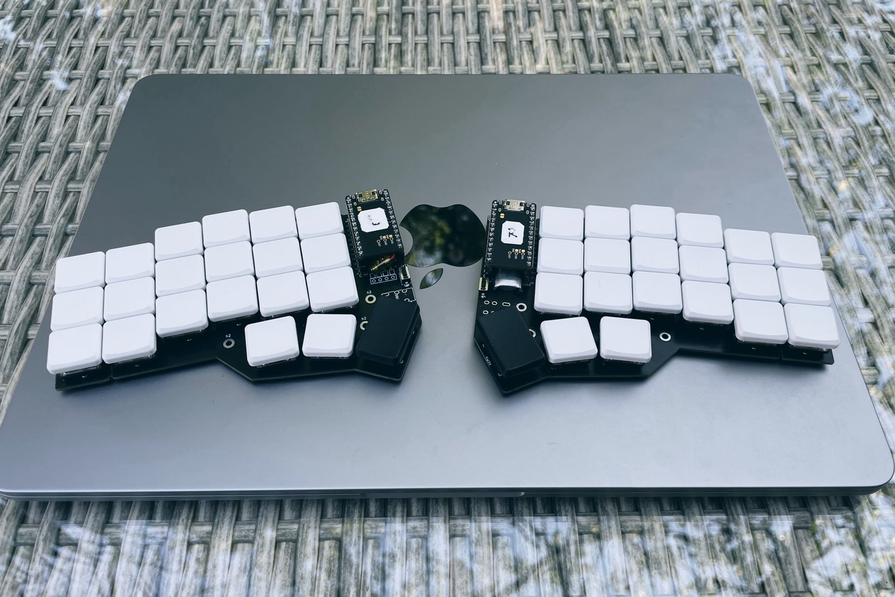

# Tools I use

Inspired by [uses.tech](https://uses.tech) where developers share their hardware, software and tools they use regularly. Here are my tools.

## Software

### Programming

* Terminal: I use [iTerm2](https://www.iterm2.com/version3.html) with
  * [zsh](https://www.zsh.org/) and with [Starship](https://starship.rs/) prompt
  * [base16-shell](https://github.com/chriskempson/base16-shell) for terminal colors
  * [zoxide](https://github.com/ajeetdsouza/zoxide) as a replacement for `cd` command
  * [eza](https://github.com/eza-community/eza) as a replacement for `ls` command
  * [bat](https://github.com/sharkdp/bat) as a replacement for `cat` command
  * [fnm](https://github.com/Schniz/fnm) for node version management
  * and here are my [dotfiles](https://github.com/armno/dotfiles) repo.

* Code editor: [VSCode](https://code.visualstudio.com/) (with Vim emulation)
  * Theme: the official [GitHub](https://github.com/primer/github-vscode-theme) themes. I use both dark and light themes, depending on the surrounding light.
  * Here is a full post on how I set up my VSCode: [My VSCode setup for 2023](https://armno.in.th/blog/vscode-setup-2023/).
* [Vim](https://www.vim.org/) for a quick file editing from the terminal.&#x20;
  * I use [vim-plug](https://github.com/junegunn/vim-plug) as a plugin manager for Vim. Here is my [`.vimrc`](https://github.com/armno/dotfiles/blob/master/.vimrc) file.&#x20;
* Git: I use command line Git with [delta](https://github.com/dandavison/delta) to render diffs and logs
* [JetBrains Mono fonts](https://www.jetbrains.com/lp/mono/) in both code editors and terminal.

### Others

* [Homebrew](https://brew.sh/) package manager
* [Arc](https://arc.net/) as the default browser, and [Chrome Canary](https://www.google.com/chrome/canary/) as the browser for development.
* [Raycast](https://www.raycast.com/) as a Spotlight replacement, calculators, shortcuts, etc.
* [Karabiner Elements](https://karabiner-elements.pqrs.org/) for keyboard shortcut customizations.
* [Rectangle](https://rectangleapp.com/) for windows management.
* [Ice](https://github.com/jordanbaird/Ice) to show/hide icons on the menu bar.
* [Pixelmator Pro](https://www.pixelmator.com/pro/) for image/photo editing
* [Cleanshot X](https://cleanshot.com/) to capture and annotate screenshots, screen recordings etc.
* [1Password](https://1password.com/) for password management
* [Google Photos](https://www.google.com/photos/about/) to backup all of my photos

### Alumni

Things I used in the past that are worth mentioning.

* [oh-my-zsh](https://ohmyz.sh/) and [oh-my-posh](https://ohmyposh.dev/) zsh frameworks.
* [z](https://github.com/rupa/z) - replaced by zoxide
* [kitty](https://sw.kovidgoyal.net/kitty/) is a GPU-accelerated terminal app and it's much faster than iTerm. The only thing that stops me from using it is that it doesn't render as beautiful text as in iTerm, probably because of the lack of supporting [sub-pixel antialiasing](https://github.com/kovidgoyal/kitty/issues/214).
* [Cursor](https://cursor.sh/) is basically VSCode with AI features which I really liked. But paying 20$ a month for a code editor is a no-go for me.
* [Alfred](https://www.alfredapp.com/) - I used Alfred for many years until I found Raycast. Thanks Alfred!
* [BetterTouchTool](https://folivora.ai/) for shortcuts, automation.

---

## Hardware

* Computers: [13-inch Macbook Air M2](https://support.apple.com/en-us/111867) at work. At home I have a [2013 13-inch MakBook Pro](https://support.apple.com/kb/sp691?locale=th_TH), but this one is rarely used nowadays.\
  
* Monitor: a [Samsung 28" UR55 UHD 4K Monitor](https://www.samsung.com/th/business/monitors/ur55/lu28r550uqexxt/) mounted with an [NB-F80 Monitor arm](https://www.google.com/search?q=nb-f80+monitor+arm).\
  
* Keyboard: Corne wireless split keyboard. I wrote about it here: [Building a Wireless Corne Keyboard](https://armno.in.th/blog/building-a-wireless-corne-keyboard/) and [Low Profile Wireless Corne Keyboard](https://armno.in.th/blog/low-profile-wireless-corne-keyboard/).\
  
* Mouse: [Logitech MX Anywhere 3S](https://www.logitech.com/en-us/products/mice/mx-anywhere-3s.910-006926.html?sp=1\&searchclick=logi)
* Headphones: I have ~~a few~~ too many of them for my various use cases
  * [Sony WH-1000XM4](https://www.sony.co.th/en/electronics/headband-headphones/wh-1000xm4) for working in a noisy environment
  * [Audio-Technica M50x](https://armno.in.th/2015/08/04/audio-technica-ath-m50x/) with [Audirect Beam 2se DAC/Amp](https://www.google.com/search?q=Audirect+Beam+2se+DAC) for music listening
  * [JBL Quantum 100](https://th.jbl.com/gaming/QUANTUM100.html) for video calls and meetings. This one has a really good mic!
  * [Soundpeats Air3](https://us.soundpeats.com/products/air3) for commuting and workouts\
    \
    

### Other

Not something I use everyday, but still worth mentioning.

* Digital camera: Fujifilm XT-20 digital camera with a TTArtisan 50mm f/1.2 manual focus lense\
  
* Bike: [2022 Nich Faith 2](https://www.nichcycling.com/pages/faith2) road bike. I use it for commuting to work sometimes and for a weekend long ride.\
  
